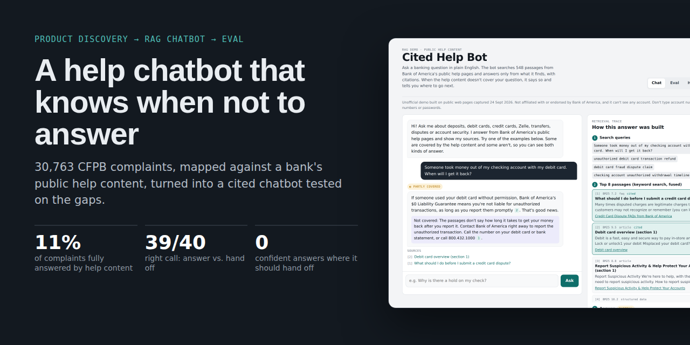
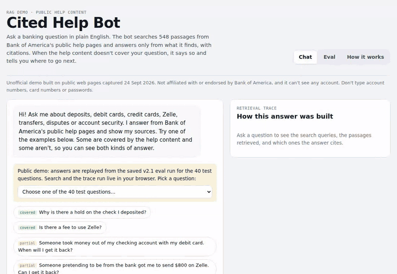
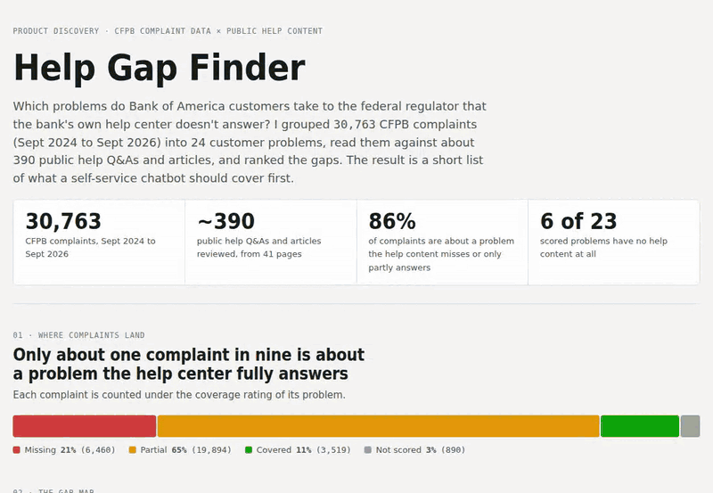
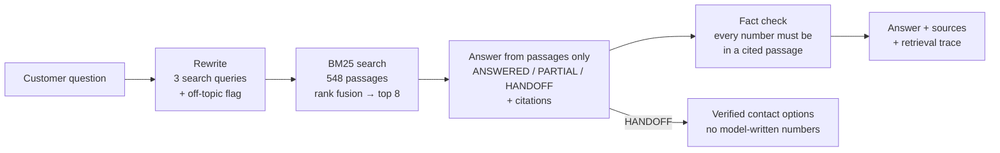
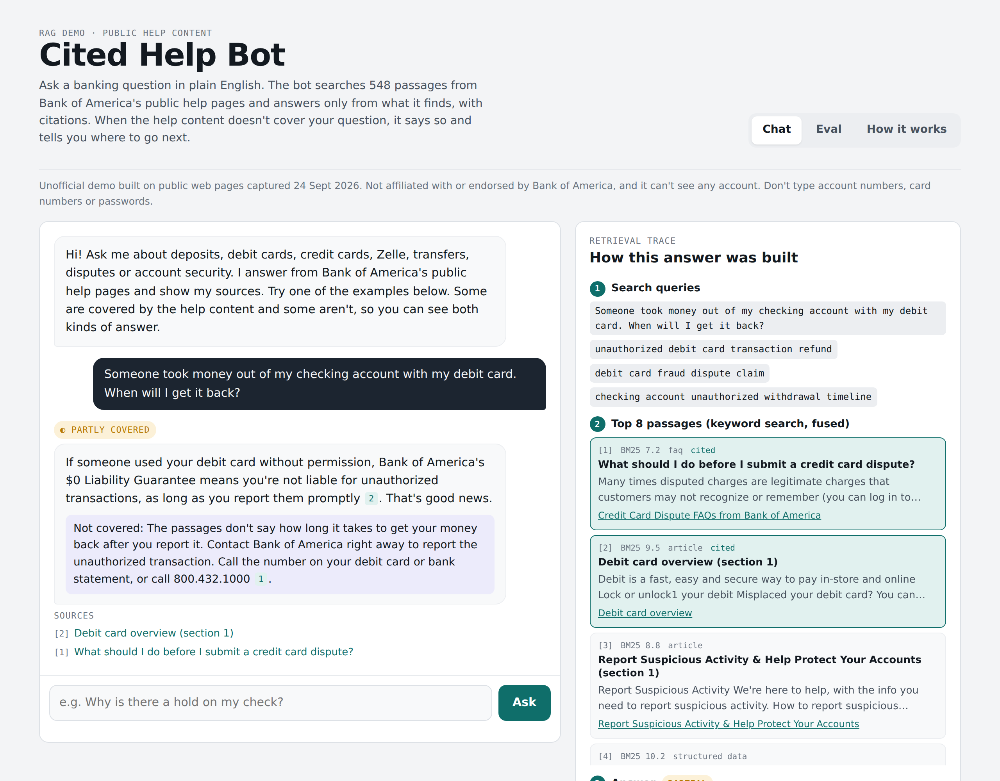

<div align="center">



# A help chatbot that knows when not to answer

**Product discovery → RAG chatbot → eval, built on public data**

[**Live demo**](https://lilybondybrooklyn.github.io/help-content-chatbot/) · [Case study](docs/CASE_STUDY.md) · [Eval report](docs/EVAL_REPORT.md) · [Decision log](docs/DECISIONS.md)

</div>

---

Most help chatbots start from the help content a company already has. **I started from what customers complain about.**

I compared **30,763 CFPB complaints** about Bank of America with the bank's public help pages and found that **only 11% of complaints concern a problem the help content fully answers.** Then I built a RAG chatbot over that same help content. It answers with citations, shows how each answer was built, fact-checks its own numbers, and hands off instead of guessing when the content doesn't cover a question. I tested it with a 40-question eval built from the gaps.

<div align="center">

<br><sub>A covered question gets a cited answer with a retrieval trace. A gap question gets an honest handoff. The Eval tab tracks every run.</sub>
</div>

## Results

| | |
|---|---|
| Complaints analyzed | **30,763** (Sept 2024 to Sept 2026; checking/savings, credit card, debt collection, money transfer) |
| Customer problems | **24**, built from 140 CFPB product/issue/sub-issue combinations |
| Complaints the help content fully answers | **11%** (65% partly answered, 21% not answered at all) |
| Problems with no help content at all | **6 of 23** scored problems |
| Chatbot: right call on answering vs. handing off | **39/40** (best run) |
| Chatbot: confident answers where it should hand off | **0** in every run |

## Part 1 · Help Gap Finder

I mapped complaints to 24 customer problems, each written as the question a customer would ask. I rated each one against the bank's public help content as covered, partial or missing, with evidence for every rating, and ranked the problems by the complaints the help content leaves unanswered.

<div align="center"></div>

**What stood out**
- **The most common gap is "what happens next".** Help pages explain how to file a dispute or report fraud, then stop. The complaints are about denied claims, reversed credits and timelines. More than half of dispute and fraud complaints ended with the bank giving money back.
- **Six problems have no help content at all:** the bank closing an account, getting money back from a closed account, collections (two problems), being unable to open an account, and stopping recurring withdrawals.
- **A content bug that matters for AI:** the overdraft FAQ shows a **$10** fee on the page, but its hidden structured data, which search engines and AI assistants read, still says **$35**.

**What the chatbot should cover first**
1. Dispute and fraud-claim status: 5,873 complaints, ~54% ended with the bank giving relief, up 19% vs. the prior six months
2. Deposit holds and missing deposits: 3,361 complaints, the most common problem
3. "The bank closed my account. Where's my money?": 2,394 complaints, no help content
4. Zelle scams and reimbursement: 1,411 complaints, up 20%, one sentence of help content
5. Stopping recurring withdrawals: 367 complaints, fastest-growing (+36%), a quick win

## Part 2 · Cited Help Bot



| Answer with citations and trace | Eval tab |
|---|---|
|  |  |

**Eval.** The 40 test questions come from the gap analysis: questions the help content covers, partly covers and doesn't cover, plus everyday lookups and off-topic questions.

| | v1 run 1 | v1 run 2 | v2.1 |
|---|---|---|---|
| Right call: answer vs. hand off | 37/40 | 38/40 | **39/40** |
| Confident answers where a handoff was expected | 0 | 0 | 0 |
| Answers citing the expected topic | 25/26 | 26/26 | 24/26 |
| Answers with a figure missing from their cited passages | 1 | 0 | 4 → fixed in v2.2 |

**What I learned:** four of my expected answers were wrong, so I relabeled them and re-scored every run. "Exact outcome" turned out to be noisy, so "right call" became the headline metric. Fixing one behavior can break another: when v2 stopped the bot from over-hedging, it started writing phone numbers from memory. That's why v2.2 takes phone numbers out of the model's hands. Details are in the [eval report](docs/EVAL_REPORT.md).

## Try it

- **[Live demo](https://lilybondybrooklyn.github.io/help-content-chatbot/)** (GitHub Pages). The Gap Finder report is fully interactive. The chatbot demo replays saved answers for the 40 test questions, while search, the trace and the fact check run live in your browser.
- **Run it yourself:**
```bash
# Gap Finder (Python 3, pandas, scikit-learn)
cd help-gap-finder && cp data/* . && python3 analyze.py && python3 retrieve.py && python3 build_data.py

# Chatbot
cd help-chatbot
python3 build_corpus.py     # clean and chunk the help pages → chunks.json
node eval_retrieval.js      # keyword-only retrieval baseline
python3 build_page.py       # live version (runs as a Claude artifact)
python3 build_demo.py       # static demo that replays a saved eval run
python3 grounding.py        # fact-check saved eval runs
```

## Repo map

| Path | Contents |
|---|---|
| `docs/CASE_STUDY.md` | The full story: problem, discovery, build, eval, what's next |
| `docs/EVAL_REPORT.md` | Metrics, run-by-run results, label changes, failure analysis |
| `docs/DECISIONS.md` | 11 product and technical decisions with their tradeoffs |
| `docs/*.html` | The GitHub Pages site: landing page, Gap Finder report, chatbot demo |
| `help-gap-finder/` | Complaint analysis pipeline and data |
| `help-chatbot/` | Corpus builder, retrieval, eval set, saved eval runs, page builders |

## Built with

Python (pandas, scikit-learn) · plain JavaScript (BM25, reciprocal-rank fusion) · Claude for query rewriting and answers · public CFPB and Bank of America web data. I used Claude as a coding and analysis partner.

<sub>Independent portfolio project using public data only. Not affiliated with or endorsed by Bank of America or the CFPB.</sub>
