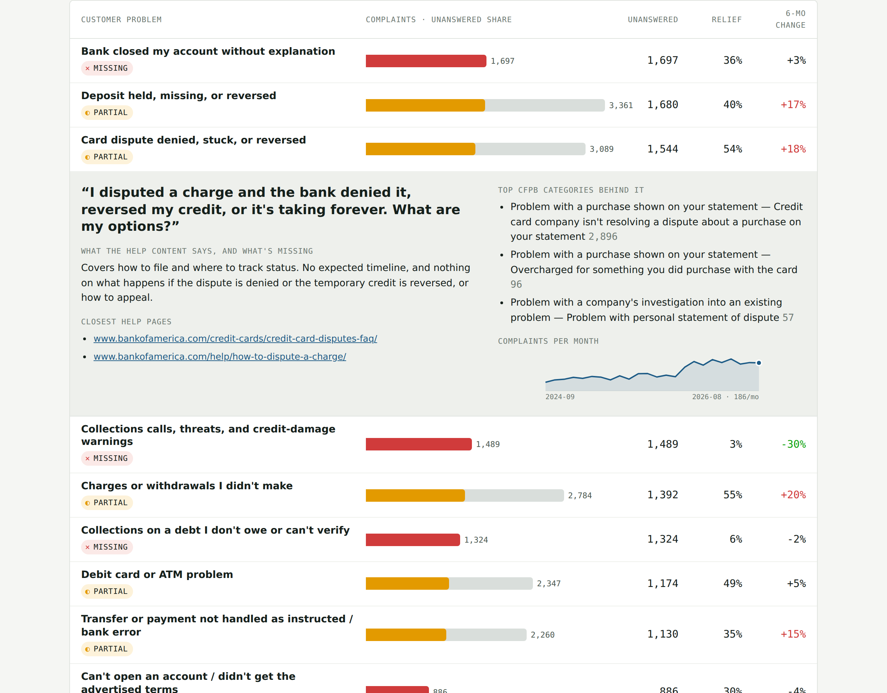

# From complaints to a chatbot that knows when not to answer

A two-part product project built entirely on public data:

1. **Help Gap Finder.** I compared 30,763 CFPB consumer complaints about Bank of America with the bank's public help content to find the problems customers escalate to a regulator that the help center doesn't answer.
2. **Cited Help Bot.** I built a retrieval-augmented (RAG) chatbot over that help content. It answers with citations, and it hands off instead of guessing when the content doesn't cover a question. I checked both behaviors with a 40-question eval built from the gap analysis.

> Independent portfolio project using public data only. Not affiliated with or endorsed by Bank of America or the CFPB.



## Results at a glance

| | |
|---|---|
| Complaints analyzed | **30,763** (Sept 2024 to Sept 2026; checking/savings, credit card, debt collection, money transfer) |
| Customer problems | **24**, built from 140 CFPB product/issue/sub-issue combinations |
| Complaints the help content fully answers | **11%** (65% partly answered, 21% not answered at all) |
| Problems with no help content at all | **6 of 23** scored problems |
| Chatbot knowledge base | **548** passages from 40 public help pages |
| Right call on answering vs. handing off | **39/40** (best run) |
| Confident answers where it should have handed off | **0** in every run |

## What's in this repo

| Path | What it is |
|---|---|
| [`docs/CASE_STUDY.md`](docs/CASE_STUDY.md) | **Start here.** The full story: problem, discovery, what I built, results, and what I'd do next |
| [`docs/EVAL_REPORT.md`](docs/EVAL_REPORT.md) | How the chatbot was tested, run-by-run results, and failure analysis |
| [`docs/DECISIONS.md`](docs/DECISIONS.md) | Product and technical decisions, with the tradeoffs behind each one |
| [`help-gap-finder/`](help-gap-finder/) | Complaint analysis pipeline (Python) and the gap report (`help-gap-finder.html`) |
| [`help-chatbot/`](help-chatbot/) | Chatbot corpus builder, retrieval, eval set, saved eval runs, and the chat page |

## The five things the chatbot should cover first

From the gap analysis, ranked by complaints the help content leaves unanswered, growth, and how much a bot can actually help:

1. **Dispute and fraud-claim status: "where's my claim, and what happens next?"** 5,873 complaints; the bank gave relief in about 54% of them; up 19% vs. the prior six months.
2. **Deposit holds and missing deposits.** 3,361 complaints, the single most common problem; up 17% vs. the prior six months.
3. **"The bank closed my account. Where's my money?"** 2,394 complaints and no help content at all.
4. **Zelle scams and reimbursement.** 1,411 complaints, up 20% vs. the prior six months, and the help content gives the topic one sentence.
5. **Stopping recurring withdrawals.** A small volume (367) but the fastest growth of any problem (+36% vs. the prior six months): a quick win.


## How to run it

**Gap Finder** (Python 3, pandas, scikit-learn)
```bash
cd help-gap-finder
cp data/* .
python3 analyze.py && python3 retrieve.py && python3 build_data.py
# open help-gap-finder.html in a browser
```

**Chatbot**
```bash
cd help-chatbot
python3 build_corpus.py      # cleans and chunks data/boa_help_corpus_v2.json into chunks.json
node eval_retrieval.js       # offline retrieval check (keyword search only)
python3 build_page.py        # builds cited-help-bot.html
python3 grounding.py         # fact-checks saved eval runs against their cited passages
```
The chat page calls Claude through the Claude artifacts runtime, so answering works when it's opened as a Claude artifact. Opened as a plain local file, only the search and trace steps run.

## Built with
Python (pandas, scikit-learn), plain JavaScript (BM25 retrieval), Claude for query rewriting and answer generation, and public CFPB and Bank of America web data. I used Claude as a coding and analysis partner throughout.
