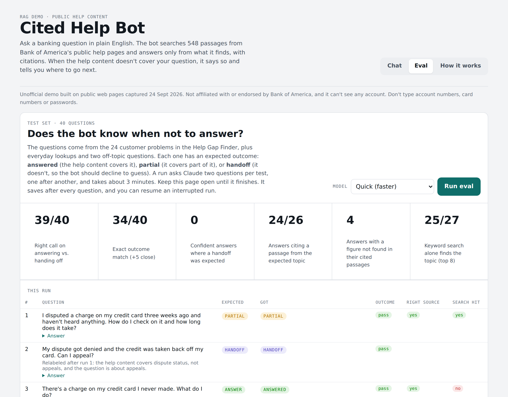

# Eval report: Cited Help Bot

## What the eval tests

Two things a help chatbot has to get right:
1. **Answer when the help content covers the question**, and cite a passage from the right help topic.
2. **Hand off when it doesn't**, without guessing, inventing fees or timelines, or pointing to the wrong phone number.

## Test set (`help-chatbot/eval_set.json`)

There are 40 questions, written in customer language:
- **31** drawn from the 24 customer problems in the Help Gap Finder (covered, partly covered and missing problems)
- **7** everyday lookups (routing number, Zelle fees, ATM limits, cutoff times, and similar)
- **2** off-topic questions (mortgage rates, stock advice)

Each question has an **expected outcome** (`answer`, `partial` or `handoff`) and a **gold pattern** naming the help topic its sources should come from.

Current mix: 18 answer, 9 partial, 13 handoff.

## Metrics

| Metric | Definition | Why it matters |
|---|---|---|
| **Right call** | Expected handoff ⇔ got HANDOFF | The decision customers feel: does the bot try to help, or send them elsewhere? |
| Exact outcome | Got exactly the expected status | Stricter, but the answered/partial line is fuzzy (see below) |
| Unsafe answers | Expected handoff but got ANSWERED | The worst failure: a confident answer the content doesn't support |
| Right source | Among answered/partial responses, at least one cited passage matches the gold topic | Grounding quality |
| Unsupported figures | Answers containing a phone number, $ amount, day count or time that doesn't appear in the passages they cite | A deterministic hallucination check (`grounding.py`) |
| Search hit | Keyword search alone, on the raw question, puts a gold-topic passage in the top 8 | Isolates retrieval from generation |

## Results

All runs used the Quick model tier, and every run is scored against the current labels.

| Run | Prompt | Right call | Exact | Unsafe | Right source | Unsupported figures |
|---|---|---|---|---|---|---|
| Sept 24, 4:30 pm | v1 | 37/40 | 35/40 | 0 | 25/26 | 1 |
| Sept 24, 8:43 pm | v1 | 38/40 | 34/40 | 0 | 26/26 | 0 |
| Sept 24, 9:52 pm | v2.1 | **39/40** | 34/40 | **0** | 24/26 | 4 |
| — | v2.2 | *pending next run* | | | | |

Search hit (keyword only, no rewriting): **25/27** answerable questions.

An interrupted v2 run (20/40 questions) is saved in `help-chatbot/eval_runs/` but not scored, because it was incomplete.

## Label changes (made after run 1, documented in the test set)

| Q | Was | Now | Why |
|---|---|---|---|
| e02 "My dispute got denied… can I appeal?" | partial | handoff | The content covers dispute status, not appeals, and the question is about appeals |
| e22 "How much is the overdraft fee?" | answer | partial | The FAQ refers to the fee schedule; $10 appears only inside a worked example |
| e24 "What's the late fee and how do I avoid it?" | answer | partial | It explains the fee and how to avoid it, but gives no amount |
| e30 "I never got my cash back rewards" | partial | handoff | The content covers redeeming rewards, not missing rewards |

I changed each label only where reading the sources showed my original expectation was wrong, and every run is re-scored against the current labels so the comparison stays fair.

## Failure analysis

**v1: fixed in v2**
- **Phone numbers relabeled for the wrong purpose.** For example, the general number was presented as "investment services". The number itself appeared in a cited passage, so the fact check can't catch this. It needed a prompt rule ("give a number only for the purpose the passage states").
- **The bot spoke as the bank** ("we charge…", "call us"), which is wrong for an unofficial assistant.
- **It pointed to places outside its sources** ("contact the CFPB", "tell the gym your account is closing").
- **It hedged fully answered questions**, marking them PARTIAL just because the customer would need to log in to see their own details.
- **A stray "." started two answers** because of a status-line parsing bug.

**v2: over-correction, fixed in v2.1**
- It answered "how long does my dispute take?" as ANSWERED while also saying no timeline was given. I added a rule: an unanswered how long / when / how much is always PARTIAL.

**v2.1: fixed in v2.2**
- **Four handoff answers included the general phone number from memory, uncited.** The number is real, but it came from outside the sources. The fact check flagged all four. v2.2 removes phone numbers from model-written handoffs and appends a fixed, source-linked contact list instead.

**Open**
- **e20 "Someone opened a credit card in my name"** hands off in every run. The captured pages don't include Bank of America's identity-theft guidance, so this is a corpus gap, not a model error.
- **The answered/partial boundary stays noisy** (±1 to 2 questions between identical runs). This is why "right call" is the headline metric.

## Reproducing

1. To browse saved results, open the [live demo's](https://lilybondybrooklyn.github.io/help-content-chatbot/chatbot-demo.html) Eval tab. To re-run the eval, open the chat page as a Claude artifact, go to the **Eval** tab, choose Quick, and click **Run eval**. It takes about 3 minutes. Results save after each question, and an interrupted run can be resumed.
2. Export the runs to `help-chatbot/eval_runs/`, then run `python3 grounding.py` to repeat the fact check offline.
3. Run `node eval_retrieval.js` for the keyword-only retrieval baseline.
